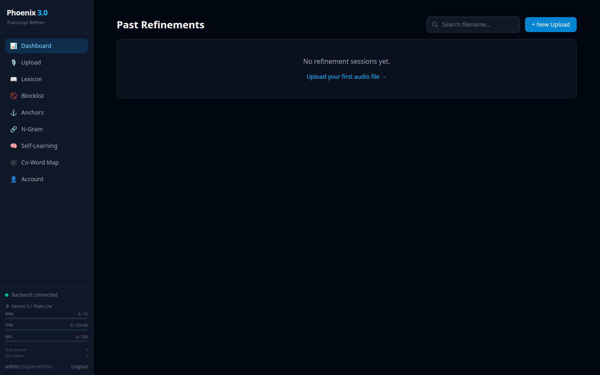
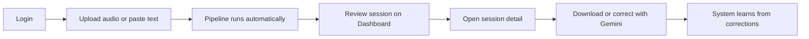

# Phoenix 3.0 – Self-Learning Transcript Refiner

Phoenix 3.0 is a **deterministic-first transcript correction system** for call-center and customer-service audio. It takes raw Whisper transcriptions (or pasted plain text) and refines them through a layered pipeline of lexicon rules, statistical N-gram analysis, and AI-assisted correction — then **learns from every fix** so accuracy improves over time.

Built for bilingual English/Filipino call recordings (collections, banking, verification), Phoenix targets the kinds of errors Whisper makes repeatedly: misheard domain terms, wrong casing, phonetically similar substitutions, and context-dependent word swaps.



---

## What It Does

When you upload an audio file or import a transcript, Phoenix:

1. **Transcribes** audio via Groq (Whisper `large-v3-turbo`) with per-word confidence scores
2. **Classifies** each segment's intent using Semantic Anchors (Greeting, Verification, Negotiation, Closing, etc.)
3. **Corrects** the text through three sequential layers (Lexicon → N-Gram → Gemini)
4. **Post-processes** currency, email, and common formatting issues
5. **Saves** the refined session to the database and logs every correction for self-learning

The result is an explainable transcript where each change is tagged with its source layer — not a black-box rewrite.

---

## Quick Start

### Prerequisites

- [Docker](https://docs.docker.com/get-docker/) and Docker Compose
- API keys (add to `.env` — copy from `.env.example`):
  - `GROQ_API_KEY` — required for audio transcription
  - `GEMINI_API_KEY` — required for Layer 3 AI correction and self-learning

### Run with Docker Compose

```bash
# 1. Copy environment template and add your API keys
cp .env.example .env

# 2. Start all services (postgres, redis, backend, frontend, pgadmin)
docker compose up --build
```

| Service   | URL                          | Purpose                          |
|-----------|------------------------------|----------------------------------|
| Frontend  | http://localhost:3000        | Web UI                           |
| Backend   | http://localhost:8000/api/v1 | REST API                         |
| pgAdmin   | http://localhost:5050        | Database browser (optional)      |

### Default Login

On first startup the backend seeds a default superadmin account:

| Username | Password |
|----------|----------|
| `admin`  | `admin`  |

> Change this password after first login via **Account** in the sidebar.

---

## Typical Workflow



1. **Sign in** at http://localhost:3000/login
2. Go to **Upload** and either:
   - Drag-and-drop audio files (WAV, MP3, M4A, FLAC, OGG, WEBM), or
   - Switch to **Plain Text Import** and paste labeled transcript lines (`Agent:`, `Client:`, `Mixed:`)
3. Choose the speaker role (agent or client) for audio uploads
4. Wait for processing — stages appear as Whisper → Lexicon → N-Gram → Gemini
5. Open the session from the **Dashboard** to review corrections, download exports, or guide Gemini with natural-language instructions
6. Corrections feed back into the **Lexicon** and **Self-Learning** loop automatically

---

## Dashboard

The Dashboard is your home screen after login. It lists all **Past Refinements** — every transcription session the system has processed.

| Element | Description |
|---------|-------------|
| **Search** | Filter sessions by filename |
| **+ New Upload** | Jump to the Upload page |
| **Status filters** | All, Completed, Processing, Failed — with live counts |
| **Date filters** | All Time, Today, Past Week, Past Month |
| **Session table** | Filename, speaker, segments, corrections, duration, timestamp |
| **Bulk actions** | Select multiple sessions and delete |

When no sessions exist yet, the empty state prompts you to upload your first audio file.

The left sidebar (visible on every page) also shows:

- **Backend connected** — live health status
- **Gemini usage** — RPM, TPM, and RPD rate-limit meters
- **Logged-in user** — role and logout link

---

## Application Pages

| Page | What you use it for |
|------|---------------------|
| **Dashboard** | Browse, search, filter, and open past refinement sessions |
| **Upload** | Submit audio files or import plain-text transcripts |
| **Lexicon** | Manage permanent and probationary word/phrase correction rules |
| **Blocklist** | Ban correction pairs the system must never learn or apply |
| **Anchors** | Configure semantic intent patterns, override logs, and domain glossary |
| **N-Gram** | Browse the trigram frequency database that powers contextual rescoring |
| **Self-Learning** | Inspect the full correction log and promotion status of learned rules |
| **Co-Word Map** | Visualize word co-occurrence relationships as an interactive graph |
| **Account** | Change your password; admins can manage user accounts |

### Session Detail

Click any session on the Dashboard to open its detail view:

- **Processing indicator** — live pipeline stage while a session runs
- **Three view modes** — Transcript Only, With Timestamps, With Corrections
- **Correction badges** — color-coded by source: `lexicon` (green), `ngram_anchor` (blue), `gemini` (purple)
- **Anchor mode tags** — intent label per segment (clickable to override)
- **Correct with Gemini** — natural-language instruction to fix a specific segment
- **Downloads** — plain transcript, timestamped, or full results with annotations

---

## How Correction Works

Phoenix applies corrections in a fixed order. Each layer builds on the previous one.

### Layer 1 — Lexicon (Permanent Rules)

A curated dictionary of known Whisper mistakes (`wrong_phrase → correct_phrase`). Rules can be scoped to a domain (e.g., only in VERIFICATION contexts) or apply globally. Matching uses word-boundary regex with longest-match-first ordering.

### Layer 2 — N-Gram + Semantic Anchors (Contextual Rescoring)

Trigram frequency analysis checks every 3-word window against a corpus built from golden transcripts. When a sequence has zero frequency but a phonetically similar alternative is well-attested, the system suggests a swap — guarded by edit-distance and confidence thresholds. Semantic Anchors classify each segment into one of 19 intent modes to bias corrections toward domain-appropriate language.

### Layer 3 — Gemini 3.1 Flash Lite (AI Teacher)

Remaining errors — especially unknown words flagged by N-Gram — are sent to Gemini in a single batched call. Corrections are auto-added to the lexicon as **probationary** rules and promoted to permanent after repeated use across sessions.

### Self-Learning Loop

| Stage | What happens |
|-------|--------------|
| Correction applied | Logged in `correction_log` with source and occurrence count |
| Probationary rule | Auto-learned fix inserted into lexicon (`is_permanent = FALSE`) |
| Auto-promotion | After ≥3 occurrences across sessions, rule becomes permanent |
| Human override | "Correct with Gemini" can demote conflicting permanent rules |
| Blocklist gate | Banned pairs are never applied, learned, or promoted |

---

## Project Structure

```
phoenix-3/
├── frontend/          # React + TypeScript + Vite + Tailwind CSS
├── backend/           # FastAPI + Python 3.12
├── config/            # pgAdmin server config
├── docker-compose.yml # Full stack orchestration
├── .env.example       # Environment variable template
├── SYSTEM_DOCUMENTATION.md  # In-depth technical reference
└── docs/images/       # Screenshots and assets
```

---

## Configuration

Copy `.env.example` to `.env` and set:

| Variable | Required | Description |
|----------|----------|-------------|
| `GROQ_API_KEY` | For audio | Groq API key for Whisper transcription |
| `GEMINI_API_KEY` | For AI layer | Google Gemini API key |
| `DATABASE_URL` | Auto (Docker) | PostgreSQL connection string |
| `REDIS_URL` | Auto (Docker) | Redis cache connection |
| `CORRECTION_THRESHOLD` | No | Occurrences before Rule-of-5 promotion (default: `5`) |

---

## Tech Stack

| Layer | Technology |
|-------|------------|
| Frontend | React 19, TypeScript, Tailwind CSS 4, Vite |
| Backend | FastAPI, uvicorn, Python 3.12 |
| Database | PostgreSQL 16 |
| Cache | Redis 7 |
| Transcription | Groq API — Whisper `large-v3-turbo` |
| AI correction | Gemini 3.1 Flash Lite |
| Auth | JWT (HS256) + bcrypt |
| Deployment | Docker Compose (5 containers) |

---

## Database Access (pgAdmin)

pgAdmin is included for direct database inspection:

1. Open http://localhost:5050
2. Login: `admin@phoenix.com` / `admin`
3. Click **Phoenix DB** in the sidebar — database password: `phoenix`
4. Browse tables under **Schemas → public → Tables**

Key tables: `lexicon`, `ngram_frequency`, `correction_log`, `transcription_sessions`, `semantic_anchors`, `domain_glossary`.

---

## Further Reading

For the complete technical reference — API endpoints, database schema, defensive mechanisms, anchor classification details, and architecture diagrams — see **[SYSTEM_DOCUMENTATION.md](SYSTEM_DOCUMENTATION.md)**.

---

## License

Private / internal use. See repository owner for licensing terms.
